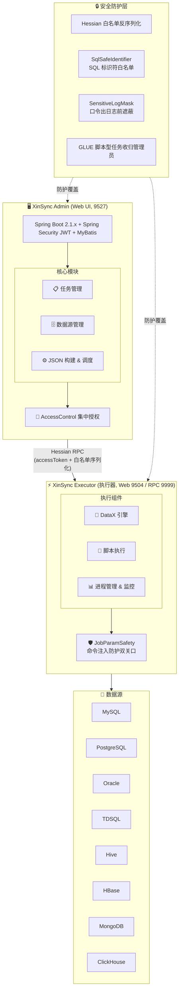

# XinSync 信数通

**信创数据同步，安全可控**

信创生态下的企业级数据集成平台 · 基于 DataX 深度安全加固

[](https://github.com/bianqiang-ui/xinsync/blob/master/LICENSE) [](https://github.com/bianqiang-ui/xinsync/releases)   

[中文](README.md) · [English](README_EN.md) · [GitHub](https://github.com/bianqiang-ui/xinsync) · [Gitee 国内镜像](https://gitee.com/brian888/xinsync)

---

## 项目简介

**XinSync 信数通** 是基于开源项目 [DataX-Web](https://github.com/WeiYe-Jing/datax-web)（v2.1.2）深度安全加固的信创数据同步平台。针对信创生态下的数据迁移、数据同步、异构数据库集成等场景，提供 **安全可控、开箱即用** 的 Web 化管理能力。

### 这次改造做了什么

> 不是简单的 Bug 修复，而是把原版"能跑起来就行"的代码base 重做了一遍安全与可维护性收口：
>
> - 📊 相对上游 **v2.1.2 发布点**（tag `v-2.1.2`，任何 clone 里都有）到**对账锚点 `67c1004`**：
>   **47 个自研提交**、**135 个文件**、**+12,095 / −734 行**。锚点就是写下这组数字时的仓库
>   HEAD，写死成 sha 而不是 `HEAD`——否则"携带这组数字的提交"自己会被算进去，谁跑都对不上；
>   下面两条命令在任何一份 clone 里都能逐字复跑，跑完由门禁第 10 条当场对账：
>   `git diff --shortstat v-2.1.2..67c1004` 与
>   `git log --author=bianqiang@gmail.com --oneline v-2.1.2..67c1004 | wc -l`
>   （不拿维护者本地的台账分支当参照——它没随 fork 推送，别人 clone 下来跑不了）
> - 🔒 修复 **15 项安全漏洞**（含 5 项 CRITICAL）：RPC 反序列化 RCE、越权（IDOR）、命令注入、Log4Shell、GLUE 脚本 RCE 等
> - 🛡️ **33 条授权接缝** 逐条闭环判定（`AccessControl` 单点实现），从"只有登录判定"到"角色 + 归属双层"
> - ✅ 收口 **社区长期悬而未决的 Issue**：#487 进程树残留、#296 Hive 连接、#389 定时任务不触发、#265 HBase 数据源等
> - 🏗️ 内置 **17 道自动化质量门禁**，任何改动都能一键复跑验证（见下文"质量门禁"）
> - 📝 每批改动的实测证据与反证记录写在 **CHANGELOG** 与对应的提交说明里（逐轮开发台账与技术手册属过程文档，不随仓库外发）
>
> **原版是一把好刀，我们给它淬了火、开了刃、配了鞘。**

### 与原版的核心区别

| 维度 | 原版 DataX-Web | XinSync 信数通 |
|------|---------------|---------------|
| **维护状态** | 2024-06 停更（Issue 开放 180+） | 持续维护，逐批带实测证据 |
| **安全加固** | 15 项已知高危漏洞 | 13 项已修复，2 项部分修复（见 CHANGELOG） |
| **授权体系** | 仅"是否登录"一层 | 33 条授权接缝 + IDOR 归属判定（归属只从库里取） |
| **口令保护** | API 返回明文/密文口令 | 全链路脱敏：API 掩码 / job_json 只写引用 / 日志与 RPC 出口遮蔽 / 临时文件创建即 0600 |
| **依赖安全** | Log4j2 2.11.2、Logback 1.2.3 等 | Log4j2 2.17.2 / Logback 1.2.13 / Fastjson 1.2.83 / Netty 4.1.100.Final 全局锁定 |
| **信创适配** | 无 | TDSQL 数据源接缝 + DDL 自动改写（分片键/主键/索引） |
| **质量门禁** | 无 | 17 道可复跑门禁 + 全仓库 shell 语法检查 |

---

## 🏗️ 架构概览



---

## ✨ 功能特性

### 数据同步核心

- ✅ 支持 **MySQL、PostgreSQL、Oracle、SQL Server、ClickHouse、Hive、HBase、MongoDB** 等主流数据源
- ✅ 支持 **TDSQL**（腾讯分布式数据库）作为数据源，并提供 DDL 自动改写（shardkey / 主键 / 索引）
- ✅ Web 界面可视化构建 DataX JSON 任务
- ✅ RDBMS 数据源 **批量创建** 同步任务
- ✅ 支持 **增量同步**（时间戳/主键自增）
- ✅ 支持 Hive **分区动态参数** 配置

### 任务调度

- ✅ 分布式任务调度（基于 xxl-job 二次开发）
- ✅ 执行器 **集群部署**，支持 9 种路由策略
- ✅ 任务超时控制、失败重试、失败告警
- ✅ 任务依赖（父子任务联动）
- ✅ 支持 DataX / Shell / Python / PowerShell 四种任务类型（脚本型任务限管理员，见安全章节）
- ✅ 执行器 CPU / 内存 / 负载实时监控

### 🔒 安全加固（XinSync 独有）

- ✅ **RPC 反序列化防护** — Hessian 白名单序列化工厂 + `accessToken` 两侧强制校验
- ✅ **IDOR 越权防护** — 33 条授权接缝闭环判定（`AccessControl` 唯一实现处，归属只取库里那一行）
- ✅ **命令注入防护** — `JobParamSafety` 双关口（入库校验 + 执行器拼命令前二次校验）
- ✅ **SQL 注入防护** — `SqlSafeIdentifier` 排序/筛选标识符白名单
- ✅ **GLUE 脚本 RCE 防护** — 除 `BEAN` 外的脚本型任务一律收归管理员（含 `GLUE_GROOVY`）
- ✅ **口令全链路脱敏** — API 回掩码 / job_json 只写数据源引用 / 日志与 RPC 出口遮蔽 / 临时文件创建即 0600 + 启动清理
- ✅ **JWT 安全** — 密钥来自 `${DATAX_JWT_SECRET}`，不再硬编码
- ✅ **Log4Shell 修复** — Log4j2 升至 2.17.2，根 POM `dependencyManagement` 全局锁定
- ✅ **依赖安全基线** — Logback 1.2.13 / Fastjson 1.2.83 / Netty 4.1.100.Final

### 🛡️ 质量门禁系统

项目内置 **17 道自动化质量门禁**，全部随仓库交付，任何改动都能一键复跑：

```bash
bash devops/fork-workflow.sh recheck
```

| 门禁 | 检查内容 |
|------|---------|
| `devops/checks/check_yaml.py` | 所有 `application.yml` 可解析 + 无重复键 |
| `devops/checks/check_ports.py` | 端口三处口径一致（yml / `bin/env.properties` / 脚本兜底） |
| `devops/checks/check_authz_seams.py` | 33 条授权接缝逐条闭环判定 + 判定实现本身的形状 |
| `devops/checks/check_sql_identifiers.py` | 排序/筛选标识符必须走 `SqlSafeIdentifier` 单点 |
| `devops/checks/check_executor_streams.py` | #487：stdout/stderr 两个读取线程都必须在 `get()` 之前启动 |
| `devops/checks/check_job_param_safety.sh` | 作业参数 shell 注入（core + executor 两模块单测真跑） |
| `devops/checks/check_datasource_secret_scrub.py` | 数据源口令"只进不出"：读接口回掩码、向导产物不含口令 |
| `devops/checks/check_log_secret_mask.sh` | 凭据出口遮蔽：四个出口 + `SensitiveLogMask` 唯一实现处 + 单测真跑 |
| `devops/checks/check_rpc_access.sh` | RPC 服务端令牌判定单点：服务调用与 `/services` 服务清单两条入口都先判定后放行（未授权回 403 且不外泄服务表） |
| `devops/checks/check_executor_tmpfile.sh` | 执行器临时文件创建即 0600、启动清理有钩子有阈值有逃生口 |
| `devops/checks/check_package_deps.sh` | 读**产出的部署包**核对依赖版本（netty/log4j2/logback 与根 pom 的 pin 一致，EOL 残留按台账逐条对上） |
| `devops/checks/check_doc_secrets.py` | 对外文档不得出现可照抄的密钥字面值与维护者本机路径 |
| `devops/checks/check_doc_commands.py` | 对外文档里每条可照抄命令都指向仓库内真实存在的路径 |
| `devops/checks/check_admin_tests.sh` | 管理端回归单测真跑（拒绝 `Tests run: 0` 式假绿） |
| `devops/checks/check_tdsql.sh` | TDSQL DDL 改写单测真跑 |
| `devops/checks/check_sql_replay.py` | 建表脚本可被同一个库重复执行：每张表要么先删再建、要么 `IF NOT EXISTS`，存用户配置的例外表不得带删表语句，也不得被裸 INSERT 追加出厂行 |
| `devops/checks/check_shard_slice.sh` | 分片广播切片链路（T2-B）：切片器唯一实现 + JobTrigger 唯一接线 + 无目标侧路由（分片路由交给 TDSQL 内核）+ querySql 拒绝切片 + 无规则回退现状，切片单测必须登记进回归名单 |

> 门禁的判据是"真跑并且看得出现在"：跑 mvn 的检查要求 `Tests run` 为正、`Failures/Errors/Skipped` 为 0，
> 只 grep 源码的检查则配反证（把守卫改坏必须变红）。

---

## 🚀 快速开始

### 环境要求

| 组件 | 版本要求 | 备注 |
|------|---------|------|
| JDK | 1.8 | 本仓库按 JDK 8 编译与验证 |
| Maven | 3.6+ | |
| MySQL | 5.7+ | 管理库；驱动为 `com.mysql.cj.jdbc.Driver` |
| Python | 2.7 / 3.x | 执行器调用 `datax.py` 需要 |
| DataX | 需已安装 | 执行器通过 `DATAX_HOME` 或 `datax.pypath` 定位 `datax.py` |

### 1. 克隆项目

```bash
git clone https://github.com/bianqiang-ui/xinsync.git
cd xinsync
```

### 2. 初始化数据库

脚本 `bin/db/datax_web.sql` 只建表、**不含建库语句**，所以先自己建库（库名要与后面的 `DB_DATABASE` 一致）：

```bash
mysql -u root -p -e "CREATE DATABASE IF NOT EXISTS dataxweb DEFAULT CHARACTER SET utf8mb4;"
mysql -u root -p dataxweb < bin/db/datax_web.sql
```

初始账号是 `admin` / `123456`（口令列为 BCrypt 哈希，出厂明文只有这一个）。

> ⚠️ **首次登录后请立即修改管理员密码。**

### 3. 配置

配置口径以环境变量为准，`application.yml` 里写的是 `${DB_HOST:127.0.0.1}` 这类"变量 + 出厂默认值"：

```bash
# 管理库连接
export DB_HOST=127.0.0.1
export DB_PORT=3306
export DB_DATABASE=dataxweb
export DB_USERNAME=your_username
export DB_PASSWORD=your_password

# 三个安全相关密钥：必须自己生成，不要把示例值当真值用
export DATAX_JWT_SECRET="$(openssl rand -base64 32)"     # JWT 签名密钥，留空会拒绝签发 token
export DATAX_AES_KEY="$(openssl rand -hex 16)"           # 数据源口令加密密钥；出厂默认值必须换掉
export DATAX_ACCESS_TOKEN="$(openssl rand -hex 16)"      # admin<->executor RPC 通道 token，两侧都要配
```

> 密钥字面值一律不要写进配置文件提交，也不要写进任何公开文档/Issue。
> Windows 上的等价配法见 `doc/XinSync-Windows-启动指南.md`。

### 4. 编译打包

**必须用 `install`，不能用 `package`** —— 部署包（assembly 插件）绑定在 `install` 阶段产出：

```bash
mvn -B clean install -DskipTests
```

产物（路径实测）：

```
packages/datax-admin_2.1.2_1.tar.gz        # 管理端：bin/ + conf/ + lib/
packages/datax-executor_2.1.2_1.tar.gz     # 执行器：bin/ + conf/ + lib/
build/datax-web-2.1.2.tar.gz               # 整合包（datax-assembly）
```

> `datax-admin/target/*.jar` 是**瘦 jar，MANIFEST 里没有 `Main-Class`**（本仓库不打 Spring Boot fat jar），
> 所以 `java -jar` 起不来是设计如此，不是环境问题。启动一律走 tar 包里的 `bin/*.sh`。

### 5. 启动服务

```bash
# 两个包各解压到自己的目录（包内没有顶层目录，必须用 -C 指定）
mkdir -p /opt/datax-web/admin /opt/datax-web/executor
tar -zxf packages/datax-admin_2.1.2_1.tar.gz   -C /opt/datax-web/admin
tar -zxf packages/datax-executor_2.1.2_1.tar.gz -C /opt/datax-web/executor

# 管理端（Web 端口 9527）
cd /opt/datax-web/admin
bash bin/datax-admin.sh start

# 执行器（Web 端口 9504，RPC 端口 9999；需要指向 DataX 安装目录）
cd /opt/datax-web/executor
export DATAX_HOME=/opt/datax        # 其下须有 bin/datax.py
bash bin/datax-executor.sh start
```

端口默认值来自各包的 `bin/env.properties`（`SERVER_PORT` / `EXECUTOR_PORT`），改这里即可，
不要靠命令行传 `--server.port`。启动是否成功看日志里的这三行：

```
Tomcat started on port(s): 9527
Tomcat started on port(s): 9504
NettyHttpServer, port = 9999
```

`bin/datax-admin.sh` / `bin/datax-executor.sh` 支持 `start | stop | restart | status`。

### 6. 访问 Web UI

浏览器打开 `http://localhost:9527`，默认账号：`admin` / `123456`

### Docker 部署

本仓库**不提供 Dockerfile 与 docker-compose 文件**，因此没有"一键容器化部署"这一步。
容器只被用作**构建与验证环境**（`maven:3.8-openjdk-8`），例如复跑门禁：

```bash
docker run --rm -v "$(pwd)":/work -v datax-m2:/root/.m2 -w /work \
  maven:3.8-openjdk-8 bash /work/devops/checks/check_admin_tests.sh
```

需要真正的容器化部署请先补 `Dockerfile`，欢迎提 PR。

详细部署文档（含实测证据与踩坑对照）：[部署指南](doc/datax-web/datax-web-deploy-V2.1.2.md)

---

## 📊 信创适配说明

| 信创数据库 | 支持状态 | 说明 |
|-----------|---------|------|
| **TDSQL**（腾讯云） | ⚠️ 接缝 + 规则已落地 | 数据源类型/元数据/reader-writer 已打通，DDL 自动改写有单测；**分库分表编排与真集群端到端待实例验收** |
| **MySQL 国产分支** | ✅ 支持 | 兼容 MySQL 协议，复用 `MySQLQueryTool` |
| **PostgreSQL 国产分支** | ✅ 支持 | 含元数据查询修正 |
| **Hive（含 Kerberos）** | ✅ 支持 | JDBC 连接与 `connectionTestQuery` 已针对 HiveServer2 收口 |
| **Oracle → 国产库** | ⚠️ 需真实环境验证 | `all_*` 视图系改写已做，**无真实 Oracle 实例未实测** |

---

## 📋 版本变更日志

详见 [CHANGELOG.md](CHANGELOG.md)

### v2.1.2-xinsync 主要变更

- 🔴 CRITICAL x 5：RPC 反序列化 RCE、IDOR 越权、命令注入、Log4Shell、GLUE 脚本 RCE
- 🟠 HIGH x 6：SQL 注入、XSS、口令泄漏（API / job_json / 日志与 RPC / 临时文件）、JWT 硬编码密钥
- 🟡 MEDIUM x 2：日志组件版本、依赖版本全局锁定
- 社区 Issue 修复：#487 进程树残留、#296 Hive、#389 调度不触发、#265 HBase 数据源、#348/#512 Python 路径等

---

## 💖 赞助支持

如果 XinSync 信数通对你有帮助，欢迎赞助支持项目持续发展！

| 微信赞赏 | 支付宝赞赏 |
|:---:|:---:|
|  |  |

### 其他支持方式

- ⭐ 给项目点个 Star
- 🐛 提交 Issue 反馈问题
- 🔀 提交 Pull Request 贡献代码
- 📢 推荐给有需要的朋友

---

## 🤝 贡献指南

欢迎参与项目贡献！

1. Fork 本仓库
2. 创建特性分支：`git checkout -b feature/your-branch`
3. 提交修改：`git commit -m 'feat: add your feature'`
4. 推送分支：`git push origin feature/your-branch`
5. 提交 Pull Request

**改安全相关代码请一并做两件事**：把判定放进唯一实现处（`AccessControl` / `JobParamSafety` /
`SensitiveLogMask` / `SqlSafeIdentifier` / `PrivateTmpFiles`），并在 `devops/checks/` 里补一条能复跑的门禁
（或把新接缝登记进已有门禁）。改完跑 `bash devops/fork-workflow.sh recheck` 确认全绿。

### 提交规范

```
feat:     新功能
fix:      修复 Bug
security: 安全修复
docs:     文档更新
refactor: 代码重构
test:     测试相关
chore:    构建/工具变更
```

---

## 📜 开源协议

本项目基于 [MIT License](LICENSE) 开源。

- 原始项目：[WeiYe-Jing/datax-web](https://github.com/WeiYe-Jing/datax-web) - 2020 WeiYe
- 安全加固版：[bianqiang-ui/xinsync](https://github.com/bianqiang-ui/xinsync) - 2026 Brian

> 本项目为 DataX-Web 的 Fork 安全增强版，遵循原项目 MIT 协议。感谢原作者及社区贡献者的工作！

---

## 📞 联系我们

- **GitHub Issues**：[提交问题](https://github.com/bianqiang-ui/xinsync/issues)
- **微信**：`13898886628`（添加时请注明 GitHub / Gitee）
- **邮箱**：997383@qq.com

---

**XinSync 信数通** — 信创数据同步，安全可控

Made with ❤️ by [边承旭](https://github.com/bianqiang-ui)
