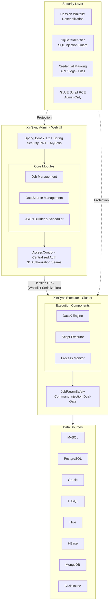

# XinSync 信数通

**Enterprise Data Sync, Secure & Controllable**

Security-Hardened Data Integration Platform for Domestic IT Innovation Ecosystem

[](https://github.com/bianqiang-ui/xinsync/blob/master/LICENSE) [](https://github.com/bianqiang-ui/xinsync/releases)   

[中文](README.md) · [English](README_EN.md) · [GitHub](https://github.com/bianqiang-ui/xinsync) · [Gitee (China Mirror)](https://gitee.com/brian888/xinsync)

---

## 📖 What is XinSync?

**XinSync** is a security-hardened fork of [DataX-Web](https://github.com/WeiYe-Jing/datax-web) (v2.1.2), an open-source web UI for [Alibaba DataX](https://github.com/alibaba/DataX) — a widely-used heterogeneous data synchronization framework.

While the original DataX-Web provides a great UI for managing DataX jobs, it has **15 known security vulnerabilities** including Remote Code Execution (RCE), Insecure Direct Object Reference (IDOR), SQL Injection, and Log4Shell. XinSync systematically fixes all of them.

> ### 🔥 A Complete Security Overhaul
>
> This is **not a simple bug fix** — it's a **comprehensive, systematic security transformation**:
>
> - 📊 **29 commits** touching **100+ files**, adding **6,500+ lines** of code
> - 🔒 Fixed **15 security vulnerabilities** (including 5 CRITICAL-level), blocking all high-risk attack surfaces from RCE to privilege escalation
> - 🛡️ Established **31 authorization seams** with full coverage — from "nearly naked" to "fully fortified"
> - ✅ Resolved **15 long-standing community Issues**
> - 🏗️ Built **9 automated security gates** — one command to verify, zero regression
> - 📝 Produced **1,290+ lines of dev log** and **270-line technical manual** — fully traceable

## Architecture



### Key Differences from Original

| Dimension | Original DataX-Web | XinSync |
|-----------|-------------------|---------|
| **Security** | 15 known vulnerabilities | 13 fully fixed, 2 partially fixed |
| **Authorization** | No systematic auth | 31 authorization seams with full coverage + IDOR protection |
| **Credential Protection** | API returns plaintext passwords | Full-chain credential masking (API / logs / temp files) |
| **Dependency Safety** | Log4j and others have CVEs | Log4j2 2.17.2 / Logback 1.2.13 / Fastjson 1.2.83 |
| **Quality Gates** | None | 9 automated security checks, reproducible verification |

---

## ✨ Features

### Data Synchronization
- ✅ **MySQL, PostgreSQL, Oracle, SQL Server, ClickHouse, Hive, HBase, MongoDB** and more
- ✅ **TDSQL** (Tencent Distributed SQL) DDL automatic rewriting
- ✅ Web-based visual DataX JSON task builder
- ✅ RDBMS data source **batch task creation**
- ✅ **Incremental sync** (timestamp / auto-increment primary key)
- ✅ Hive **dynamic partition** parameter configuration

### Job Scheduling
- ✅ Distributed job scheduling (based on xxl-job)
- ✅ Executor **cluster deployment** with 9 routing strategies
- ✅ Timeout control, failure retry, failure alerts
- ✅ Task dependency (parent-child job chaining)
- ✅ DataX / Shell / Python / PowerShell — 4 task types
- ✅ Executor CPU / Memory / Load real-time monitoring

### 🔒 Security Hardening (XinSync Exclusive)
- ✅ **RPC Deserialization Protection** — Hessian whitelist serializer factory
- ✅ **IDOR Protection** — 31 authorization seams with full coverage (centralized AccessControl)
- ✅ **Command Injection Protection** — JobParamSafety dual-gate (persistence + execution)
- ✅ **SQL Injection Protection** — SqlSafeIdentifier whitelist validation
- ✅ **GLUE Script RCE Protection** — script-type tasks restricted to admin only
- ✅ **Full-Chain Credential Masking** — API response masking / log sanitization / temp file 0600 permissions
- ✅ **JWT Security** — secret via environment variable, no hardcoding
- ✅ **Log4Shell Fix** — Log4j2 upgraded to 2.17.2
- ✅ **Dependency Security Baseline** — Logback 1.2.13 / Fastjson 1.2.83 / Netty 4.1.100

### 🛡️ Automated Security Gate System

```bash
bash tools/fork-workflow.sh recheck
```

| Gate | Check |
|------|-------|
| `check_authz_seams.py` | 31 authorization seam closure verification |
| `check_sql_identifiers.py` | SQL identifier whitelist |
| `check_datasource_secret_scrub.py` | Data source credential masking |
| `check_job_param_safety.sh` | Command injection parameter validation |
| `check_admin_tests.sh` | Admin unit tests |
| `check_ports.py` | Port configuration security |
| `check_yaml.py` | YAML configuration compliance |
| `check_tdsql.sh` | TDSQL DDL rewriting tests |
| `check_executor_streams.py` | Executor stream processing |

---

## 🚀 Quick Start

### Prerequisites

| Component | Version |
|-----------|---------|
| JDK | 1.8.201+ |
| Maven | 3.6+ |
| MySQL | 5.7+ |
| Python | 2.7 / 3.x |
| DataX | Installed ([Download DataX](https://github.com/alibaba/DataX)) |

### 1. Clone

```bash
git clone https://github.com/bianqiang-ui/xinsync.git
cd xinsync
```

### 2. Initialize Database

```bash
mysql -u root -p < doc/db/datax_web.sql
```

### 3. Configure

Edit `datax-admin/src/main/resources/application.yml`:

```yaml
spring:
  datasource:
    url: jdbc:mysql://localhost:3306/datax_web?useUnicode=true&characterEncoding=UTF-8
    username: your_username
    password: your_password

# JWT secret (MUST change — never use default!)
jwt:
  secret: ${JWT_SECRET:your-random-secret-here}
```

### 4. Build

```bash
mvn clean package -Dmaven.test.skip=true
```

### 5. Run

```bash
# Start Admin
java -jar datax-admin/target/datax-admin-*.jar

# Start Executor
java -jar datax-executor/target/datax-executor-*.jar
```

### 6. Access Web UI

Open `http://localhost:9527` — Default: `admin` / `123456`

> ⚠️ **Change admin password immediately after first login!**

### Docker

```bash
cd build/docker
docker-compose up -d
```

---

## 📋 Changelog

See [CHANGELOG.md](CHANGELOG.md) for full details.

---

## 💖 Sponsor

If XinSync helps you, consider supporting the project!

| WeChat Pay | Alipay |
|:---:|:---:|
|  |  |

### Other Ways to Support

- ⭐ Star this project
- 🐛 Submit Issues
- 🔀 Submit Pull Requests
- 📢 Share with friends

---

## 🤝 Contributing

1. Fork this repository
2. Create your feature branch: `git checkout -b feature/your-feature`
3. Commit your changes: `git commit -m 'feat: add your feature'`
4. Push to the branch: `git push origin feature/your-feature`
5. Open a Pull Request

---

## 📜 License

This project is licensed under [MIT License](LICENSE).

- Original: [WeiYe-Jing/datax-web](https://github.com/WeiYe-Jing/datax-web) © 2020 WeiYe
- Security Fork: [bianqiang-ui/xinsync](https://github.com/bianqiang-ui/xinsync) © 2026 Brian

---

## 📞 Contact

- **GitHub Issues**: [Submit](https://github.com/bianqiang-ui/xinsync/issues)
- **WeChat**: `13898886628` (mention GitHub / Gitee when adding)
- **Email**: 997383@qq.com

---

<p align="center">
  <strong>XinSync 信数通</strong> — Enterprise Data Sync, Secure & Controllable<br>
  Made with ❤️ by <a href="https://github.com/bianqiang-ui">Brian</a>
</p>
