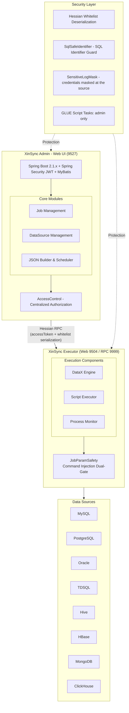

# XinSync 信数通

**Enterprise Data Sync, Secure & Controllable**

Security-Hardened Data Integration Platform for Domestic IT Innovation Ecosystem

[](https://github.com/bianqiang-ui/xinsync/blob/master/LICENSE) [](https://github.com/bianqiang-ui/xinsync/releases)   

[中文](README.md) · [English](README_EN.md) · [GitHub](https://github.com/bianqiang-ui/xinsync) · [Gitee (China Mirror)](https://gitee.com/brian888/xinsync)

---

## 📖 What is XinSync?

**XinSync** is a security-hardened fork of [DataX-Web](https://github.com/WeiYe-Jing/datax-web) (v2.1.2), an open-source web UI for [Alibaba DataX](https://github.com/alibaba/DataX) — a widely-used heterogeneous data synchronization framework.

The upstream project stopped being maintained in June 2024 with 180+ open issues, among them Remote Code Execution (RCE), Insecure Direct Object Reference (IDOR), SQL Injection, command injection and Log4Shell. XinSync fixes them one by one, each batch shipped with unit tests, a reproducible gate script and a falsification record.

> ### 🔥 A Complete Security Overhaul
>
> This is **not a simple bug fix** — it's a **comprehensive, systematic security transformation**:
>
> - 📊 Against the upstream **v2.1.2 release point** (tag `v-2.1.2`, present in every clone), up to the
>   reconciliation anchor `67c1004`: **47 of our own commits**, **135 files**, **+12,095 / −734 lines**.
>   The anchor is literally the repository HEAD at the moment these numbers were written — pinned as a
>   sha rather than `HEAD`, because otherwise the commit carrying the numbers counts itself and nobody
>   can ever reproduce them. Both commands run verbatim in any clone, and gate #10 re-measures them:
>   `git diff --shortstat v-2.1.2..67c1004` and
>   `git log --author=bianqiang@gmail.com --oneline v-2.1.2..67c1004 | wc -l`
>   (we deliberately do not quote the maintainer's local baseline branch — it was never pushed with the fork,
>   so a fresh clone could not reproduce it)
> - 🔒 Fixed **15 security vulnerabilities** (5 of them CRITICAL) — RPC deserialization RCE, IDOR, command injection, Log4Shell, GLUE script RCE
> - 🛡️ **33 authorization seams** verified one by one by a gate script (single `AccessControl` implementation, ownership always read back from the DB row)
> - ✅ Long-standing community issues closed: #487 orphan process tree, #296 Hive connection, #389 scheduler stalls, #265 HBase datasource, and more
> - 🏗️ **18 automated security gates** — one command to re-run everything, zero silent regression
> - 📝 Every batch ships with measured evidence and falsification records, written into the **CHANGELOG**
>   and the corresponding commit messages (the round-by-round working ledger and technical manual are
>   process documents and are not published with the repository)

## Architecture



### Key Differences from Original

| Dimension | Original DataX-Web | XinSync |
|-----------|-------------------|---------|
| **Maintenance** | Unmaintained since 2024-06, 180+ open issues | Actively maintained, batch by batch with evidence |
| **Security** | 15 known vulnerabilities | 13 fixed, 2 partially fixed (see CHANGELOG) |
| **Authorization** | "Is the user logged in?" only | 33 authorization seams + IDOR ownership checks |
| **Credential Protection** | API returns credential material | Full chain: API mask / job_json stores references only / logs and RPC exits masked / temp files created 0600 |
| **Dependency Safety** | Log4j2 2.11.2, Logback 1.2.3, … | Log4j2 2.17.2 / Logback 1.2.13 / Fastjson 1.2.83 / Netty 4.1.100.Final locked in the root POM |
| **Domestic DB Support** | None | TDSQL datasource seam + DDL rewriting (shardkey / primary key / indexes) |
| **Quality Gates** | None | 18 automated security gates, reproducible verification |

---

## ✨ Features

### Data Synchronization
- ✅ **MySQL, PostgreSQL, Oracle, SQL Server, ClickHouse, Hive, HBase, MongoDB** and more
- ✅ **TDSQL** (Tencent Distributed SQL) DDL automatic rewriting
- ✅ Web-based visual DataX JSON task builder
- ✅ RDBMS data source **batch task creation**
- ✅ **Incremental sync** (timestamp / auto-increment primary key)
- ✅ Hive **dynamic partition** parameter configuration

### Job Scheduling
- ✅ Distributed job scheduling (based on xxl-job)
- ✅ Executor **cluster deployment** with 9 routing strategies
- ✅ Timeout control, failure retry, failure alerts
- ✅ Task dependency (parent-child job chaining)
- ✅ DataX / Shell / Python / PowerShell — 4 task types (script types are admin-only, see below)
- ✅ Executor CPU / Memory / Load real-time monitoring

### 🔒 Security Hardening (XinSync Exclusive)
- ✅ **RPC Deserialization Protection** — Hessian whitelist serializer factory + `accessToken` enforced on both sides
- ✅ **IDOR Protection** — 33 authorization seams verified closed (single `AccessControl` implementation)
- ✅ **Command Injection Protection** — `JobParamSafety` dual-gate (persistence + execution)
- ✅ **SQL Injection Protection** — `SqlSafeIdentifier` whitelist for sort/filter identifiers
- ✅ **GLUE Script RCE Protection** — everything except `BEAN` requires admin (including `GLUE_GROOVY`)
- ✅ **Full-Chain Credential Masking** — API returns a fixed mask / job_json keeps datasource references only / logs and RPC exits mask at the source / temp files created 0600 with startup cleanup
- ✅ **JWT Security** — secret comes from `${DATAX_JWT_SECRET}`, no hardcoded value
- ✅ **Log4Shell Fix** — Log4j2 upgraded to 2.17.2
- ✅ **Dependency Security Baseline** — Logback 1.2.13 / Fastjson 1.2.83 / Netty 4.1.100.Final

### 🛡️ Automated Security Gate System

**18 automated security gates** ship inside the repository, so any change — including a fresh clone — can be re-verified with one command:

```bash
bash devops/fork-workflow.sh recheck
```

| Gate | Check |
|------|-------|
| `devops/checks/check_yaml.py` | Every `application.yml` parses, no duplicate keys |
| `devops/checks/check_ports.py` | Port values consistent across yml / `bin/env.properties` / script fallback |
| `devops/checks/check_authz_seams.py` | 33 authorization seams closed, plus the shape of the decision code itself |
| `devops/checks/check_sql_identifiers.py` | Sort/filter identifiers go through the single `SqlSafeIdentifier` |
| `devops/checks/check_executor_streams.py` | #487: both stdout/stderr reader threads start before `get()` |
| `devops/checks/check_job_param_safety.sh` | Shell-metacharacter deny on job parameters (core + executor tests really run) |
| `devops/checks/check_datasource_secret_scrub.py` | Datasource passwords never leave: read APIs mask, job_json carries references |
| `devops/checks/check_log_secret_mask.sh` | Credentials masked at every toString/log exit; `SensitiveLogMask` is the only implementation |
| `devops/checks/check_rpc_access.sh` | Single RPC-server token decision; both entry points (service invoke and the `/services` map) are authorized first — unauthorized gets 403 with no service names |
| `devops/checks/check_executor_tmpfile.sh` | Executor temp files created 0600; startup cleanup has hook, threshold and escape hatch |
| `devops/checks/check_package_deps.sh` | Reads the **built deployment packages** and pins the shipped jar versions against the root pom (netty family, log4j2, logback; EOL leftovers reconciled against a per-package ledger) |
| `devops/checks/check_doc_secrets.py` | No copy-pasteable secret literals or maintainer-local paths in public docs |
| `devops/checks/check_doc_commands.py` | Every copy-pasteable command in the docs points at a path that exists in this repo |
| `devops/checks/check_admin_tests.sh` | Admin regression tests really run (rejects `Tests run: 0` fake green) |
| `devops/checks/check_tdsql.sh` | TDSQL DDL rewriting tests really run |
| `devops/checks/check_sql_replay.py` | The import SQL can be replayed against the same database: every table is either dropped-and-recreated or created `IF NOT EXISTS`; the user-config table is never dropped and never re-seeded by a plain INSERT |
| `devops/checks/check_shard_slice.sh` | Sharding-broadcast slicing pipeline (T2-B): single slicer implementation + single JobTrigger wiring + no target-side routing (shard routing stays inside TDSQL) + querySql refuses slicing + fallback to legacy behavior without a rule; slice tests must be registered in the regression gate |
| `devops/checks/check_datacheck_seam.sh` | Open-source seam of the consistency check (pair validation / common tables / per-table counts / checksum template) + closed-source isolation red line (no closed-source coordinates inside the public repo, no self-built JDBC connections) |

> Gate judging is deliberately strict: the Maven-backed gates require a positive `Tests run` with
> `Failures: 0, Errors: 0, Skipped: 0`; the static gates come with falsification records
> (break the guard → the gate must go red → restore → green).

---

## 🚀 Quick Start

### Prerequisites

| Component | Version | Notes |
|-----------|---------|-------|
| JDK | 1.8 | this fork is compiled and verified on JDK 8 |
| Maven | 3.6+ | |
| MySQL | 5.7+ | admin database; driver is `com.mysql.cj.jdbc.Driver` |
| Python | 2.7 / 3.x | required by the executor to launch `datax.py` |
| DataX | must be installed | executor locates `datax.py` via `DATAX_HOME` or `datax.pypath` |

### 1. Clone

```bash
git clone https://github.com/bianqiang-ui/xinsync.git
cd xinsync
```

### 2. Initialize Database

`bin/db/datax_web.sql` creates tables only — **it contains no `CREATE DATABASE`**, so create the schema first (the name must match `DB_DATABASE`):

```bash
mysql -u root -p -e "CREATE DATABASE IF NOT EXISTS dataxweb DEFAULT CHARACTER SET utf8mb4;"
mysql -u root -p dataxweb < bin/db/datax_web.sql
```

The initial account is `admin` / `123456` (the password column stores a BCrypt hash; that is the only shipped plaintext password).

> ⚠️ **Change the admin password immediately after the first login.**

### 3. Configure

Configuration is driven by environment variables; `application.yml` ships `${DB_HOST:127.0.0.1}` style "variable + factory default" values:

```bash
# admin database connection
export DB_HOST=127.0.0.1
export DB_PORT=3306
export DB_DATABASE=dataxweb
export DB_USERNAME=your_username
export DB_PASSWORD=your_password

# three security secrets: generate your own, never reuse an example value
export DATAX_JWT_SECRET="$(openssl rand -base64 32)"   # JWT signing key
export DATAX_AES_KEY="$(openssl rand -hex 16)"         # datasource password encryption key; replace the factory default
export DATAX_ACCESS_TOKEN="$(openssl rand -hex 16)"    # admin<->executor RPC channel token, required on both sides
```

> Never commit secret literals, and never paste them into public docs or issues.

### 4. Build

**Use `install`, not `package`** — the deployable assemblies are bound to the `install` phase:

```bash
mvn -B clean install -DskipTests
```

Produced artifacts (paths verified):

```
packages/datax-admin_2.1.2_1.tar.gz        # admin: bin/ + conf/ + lib/
packages/datax-executor_2.1.2_1.tar.gz     # executor: bin/ + conf/ + lib/
build/datax-web-2.1.2.tar.gz               # combined package (datax-assembly)
```

> `datax-admin/target/*.jar` is a **thin jar without `Main-Class` in its MANIFEST** (this fork does not build a
> Spring Boot fat jar), so `java -jar` failing is by design, not an environment problem. Always start from the
> `bin/*.sh` scripts inside the tar package.

### 5. Run

```bash
# both archives have no top-level directory, so extract each into its own folder
mkdir -p /opt/datax-web/admin /opt/datax-web/executor
tar -zxf packages/datax-admin_2.1.2_1.tar.gz   -C /opt/datax-web/admin
tar -zxf packages/datax-executor_2.1.2_1.tar.gz -C /opt/datax-web/executor

# admin (web port 9527)
cd /opt/datax-web/admin
bash bin/datax-admin.sh start

# executor (web port 9504, RPC port 9999; needs to know where DataX lives)
cd /opt/datax-web/executor
export DATAX_HOME=/opt/datax        # must contain bin/datax.py
bash bin/datax-executor.sh start
```

Default ports come from each package's `bin/env.properties` (`SERVER_PORT` / `EXECUTOR_PORT`) — change them there
rather than passing `--server.port` on the command line. A successful start shows these three lines:

```
Tomcat started on port(s): 9527
Tomcat started on port(s): 9504
NettyHttpServer, port = 9999
```

`bin/datax-admin.sh` and `bin/datax-executor.sh` support `start | stop | restart | status`.

### 6. Access Web UI

Open `http://localhost:9527` — default account: `admin` / `123456`

### Docker

This repository ships **no Dockerfile and no docker-compose file**, so there is no one-command container deployment.
Containers are used here as a **build and verification environment** (`maven:3.8-openjdk-8`), for example to re-run a gate:

```bash
docker run --rm -v "$(pwd)":/work -v datax-m2:/root/.m2 -w /work \
  maven:3.8-openjdk-8 bash /work/devops/checks/check_admin_tests.sh
```

If you need real containerized deployment, please add a `Dockerfile` and open a PR.

Detailed deployment guide (with measured evidence and pitfall comparison): [deployment doc](doc/datax-web/datax-web-deploy-V2.1.2.md)

---

## 📊 Domestic Database (Xinchuang) Support

| Database | Status | Notes |
|----------|--------|-------|
| **TDSQL** (Tencent Cloud) | ⚠️ Seam + rules landed | datasource type / metadata / reader-writer wired, DDL rewriting unit-tested; **sharding orchestration and real-cluster acceptance still pending an instance** |
| **MySQL derivatives** | ✅ Supported | reuses `MySQLQueryTool` over the MySQL protocol |
| **PostgreSQL derivatives** | ✅ Supported | metadata queries corrected |
| **Hive (incl. Kerberos)** | ✅ Supported | JDBC connection and `connectionTestQuery` hardened for HiveServer2 |
| **Oracle → domestic DB** | ⚠️ Needs real instance | `all_*` view rewrites done, **not verified against a live Oracle** |

---

## 📋 Changelog

See [CHANGELOG.md](CHANGELOG.md) for full details.

- 🔴 CRITICAL x 5: RPC deserialization RCE, IDOR, command injection, Log4Shell, GLUE script RCE
- 🟠 HIGH x 6: SQL injection, XSS, credential leakage (API / job_json / logs & RPC / temp files), hardcoded JWT secret
- 🟡 MEDIUM x 2: logging component versions, dependency versions locked globally

---

## 💖 Sponsor

If XinSync helps you, consider supporting the project!

| WeChat Pay | Alipay |
|:---:|:---:|
|  |  |

### Other Ways to Support

- ⭐ Star this project
- 🐛 Submit Issues
- 🔀 Submit Pull Requests
- 📢 Share with friends

---

## 🤝 Contributing

1. Fork this repository
2. Create your feature branch: `git checkout -b feature/your-branch`
3. Commit your changes: `git commit -m 'feat: add your feature'`
4. Push to the branch: `git push origin feature/your-branch`
5. Open a Pull Request

**When you touch security-relevant code, do two more things**: put the decision in the single implementation point
(`AccessControl` / `JobParamSafety` / `SensitiveLogMask` / `SqlSafeIdentifier` / `PrivateTmpFiles`), and register the
new seam or rule in `devops/checks/`. Then run `bash devops/fork-workflow.sh recheck` and make sure it is green.

---

## 📜 License

Current versions of this project are licensed under **[GNU AGPL-3.0](LICENSE)**.

- Original: [WeiYe-Jing/datax-web](https://github.com/WeiYe-Jing/datax-web) © 2020 WeiYe — the original MIT notice is preserved in [NOTICE](NOTICE) and [LICENSE-MIT-UPSTREAM](LICENSE-MIT-UPSTREAM) as required by the MIT license
- Security Fork: [bianqiang-ui/xinsync](https://github.com/bianqiang-ui/xinsync) © 2026 Brian
- Embedded xxl-rpc code is Apache-2.0 licensed; see [NOTICE](NOTICE) §3
- Commercial licensing (closed-source add-ons and alternative licensing): contact the repository owner

> Historical MIT versions remain valid under MIT; new versions since 2026-10 are AGPL-3.0.

---

## 📞 Contact

- **GitHub Issues**: [Submit](https://github.com/bianqiang-ui/xinsync/issues)
- **WeChat**: `13898886628` (mention GitHub / Gitee when adding)
- **Email**: 997383@qq.com

---

<p align="center">
  <strong>XinSync 信数通</strong> — Enterprise Data Sync, Secure & Controllable<br>
  Made with ❤️ by <a href="https://github.com/bianqiang-ui">Brian</a>
</p>
