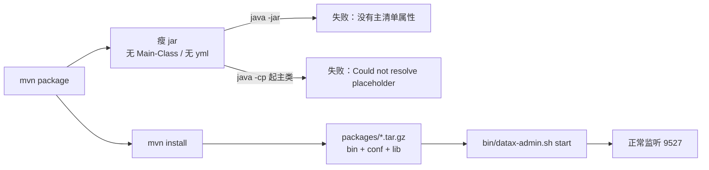
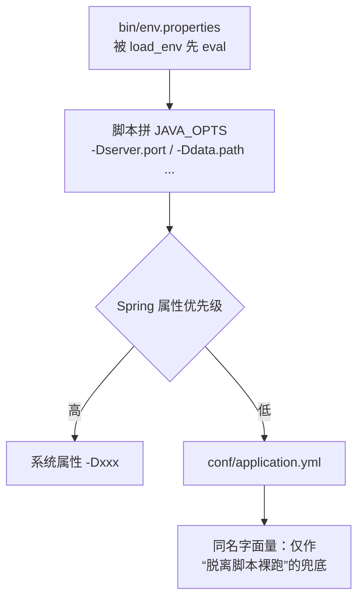

# datax-web 2.1.2 部署说明（本机实测版）

> 这篇是对 `datax-web-deploy-V2.1.1.md` 的纠正与补充：**V2.1.1 里"编译出 jar 后 `nohup java -jar` 就能跑"这一步在当前版本是跑不起来的**（详见下面第 3 节，有实测证据）。
> 本文所有端口、路径、日志文案都是在 Linux 容器里用**真实部署包 + 官方启动脚本 + 本地 MySQL 8** 跑出来的，不是照抄旧文档。

## 1. 依赖与版本

| 组件 | 版本要求 | 备注 |
|:---|:---|:---|
| JDK | **8** | 工程按 1.8 编译，JDK17/21 直接 `mvn` 会报与改动无关的错 |
| MySQL | 8.0 推荐，最低 5.6 | 驱动已是 `com.mysql.cj.jdbc.Driver`（Connector/J 8.0.33）；老 5.5 库需退回 5.1.x 驱动 |
| Python | 2.7 或 3.x | Python3 需替换 `datax/bin` 下三个 py 文件（见 `doc/datax-web/datax-python3`） |
| DataX | 与 executor 同机 | 需要 `DATAX_HOME` 指向其安装目录 |
| Maven | 3.x | 用于第 3 节构建 |

## 2. 建库

脚本位置是 **`bin/db/datax_web.sql`**（V2.1.1 文档写的 `doc/db/datax_web.sql` 在本仓库不存在）。共 **12 张表**，导入后请核对表数量，部分表对 MySQL 版本敏感。

初始账号：**admin / 123456**。

> 部署完第一件事就是改这个口令。admin 启动时会连库检测该账号是否仍是出厂哈希，是则打一条 ERROR：
> `account 'admin' still uses the password shipped with bin/db/datax_web.sql, log in and change it before exposing this service.`
> 改完口令这条 ERROR 自然消失；没消失就说明还在用出厂口令。

## 3. 构建：必须 `install`，`package` 出来的 jar 是故意不能直接运行的

```bash
mvn -B clean install -DskipTests
```

产物在**仓库根目录**的 `packages/`：

```
packages/datax-admin_2.1.2_1.tar.gz
packages/datax-executor_2.1.2_1.tar.gz
```

解包后每个都是 `bin/ + conf/ + lib/` 三件套，启动脚本用
`-classpath "lib/*:conf:."` 加主类启动，**配置读的是 `conf/` 而不是 jar 内部**。

### 为什么不能 `java -jar datax-admin-2.1.2.jar`

实测：`datax-admin/target/datax-admin-2.1.2.jar` 只有 **291 个条目、约 1.5 MB**，`MANIFEST.MF` 里**没有 `Main-Class`**，也没有 `BOOT-INF/`。原因是 `datax-admin/pom.xml` 有意为之：

- `maven-jar-plugin` 显式 `<excludes>` 掉 `**/*.yml`、`**/*.properties`、`**/*.sh`、`**/*.xml`；
- 全仓库**没有** `spring-boot-maven-plugin`，因此不存在"repackage 成可执行 fat jar"这一步；
- `maven-assembly-plugin` 绑在 **`install`** 阶段（不是 `package`），所以只跑 `package` 连 `packages/*.tar.gz` 都不会生成（若你看到 tar 包时间戳没变，那它是上一轮 `install` 留下的旧包）。



这一条能解释社区反复出现的三类报障：`java -jar` 报"没有主清单属性"、报 `Could not resolve placeholder 'server.port'`、以及 #492 的"找不到主类 `com.alibaba.datax.core.Engine`"（最后这条属 `DATAX_HOME` 未就绪，见第 6 节，与 datax-web 自身的打包无关）。

想走 IDE 直跑源码的路子，看 `doc/datax-web/idea-start-datax.md`。

## 4. 配置：先搞清楚"哪个文件生效"

这是当前版本最容易配错的地方。**打包部署时端口的真实来源是 `bin/env.properties`，不是 `conf/application.yml`**：启动脚本先 `eval` 加载 `env.properties`，再把它拼成 `-Dserver.port=...` 等 JVM 参数，而 `-D` 的优先级高于 yml。



### 4.1 datax-admin

`bin/env.properties`（打包后即 `conf` 同级的 `bin/env.properties`）：

| 键 | 出厂值 | 说明 |
|:---|:---|:---|
| `SERVER_PORT` | **9527** | admin 对外 Web/API 端口。**不是 8080**：老文档里的 8080 是 xxl-job 的默认端口，本项目 `conf/application.yml` 写死 `server.port: 9527`（不能写成 `${server.port:9527}`，同名自引用会触发 Circular placeholder reference） |
| `DATA_PATH` | `${BIN}/../data` | 日志、临时数据根目录 |
| `MAIL_USERNAME` / `MAIL_PASSWORD` | 空 | 需要邮件告警才填 |

`conf/application.yml` 里与部署相关的主要是数据源与密钥，全部走占位符，**建议用环境变量注入而不要写进文件**（口令不落盘、不进 git）：

| 环境变量 | 对应配置 | 不设会怎样 |
|:---|:---|:---|
| `DB_HOST` / `DB_PORT` / `DB_DATABASE` / `DB_USERNAME` / `DB_PASSWORD` | `spring.datasource.*` | 走 yml 默认值（`127.0.0.1:3306`、库名 `dataxweb`，注意与真实库名 `datax_web` 不同） |
| `DATAX_JWT_SECRET` | `datax.jwt.secret` | 为空 → 登录 token 无法跨重启校验（启动时随机生成密钥，重启即全员掉线；多实例必须设成同一个值）。注意属性名是 `datax.jwt.secret` 而不是 `security.jwt.secret`，配错了不会报错、只会静默无效 |
| `DATAX_AES_KEY` | `datasource.aes.key` | 用出厂 key → 启动打 ERROR，且**任何登录用户都能解出数据源口令** |
| `DATAX_ACCESS_TOKEN` | `datax.job.accessToken` | 为空 → 执行器匿名回调被拒（默认安全侧） |

> 注意 `env.properties` 里还有两个**死键**：`WEB_LOG_PATH`、`WEB_CONF_PATH`。脚本读的是 `SERVICE_LOG_PATH`、`SERVICE_CONF_PATH`，改前者无效。日志文件的位置也不跟 `SERVICE_LOG_PATH` 走 —— 脚本传的是 `-Dlog.path`，而 `conf/logback.xml` 读的是 `${LOG_PATH}`（不同名），实测落在 `<安装根>/data/applogs/admin/datax-admin.log`。

### 4.2 datax-executor

`bin/env.properties`：

| 键 | 出厂值 | 说明 |
|:---|:---|:---|
| `SERVER_PORT` | **9504** | 执行器自身 web 端口，不能与 admin 相同 |
| `EXECUTOR_PORT` | **9999** | 执行器 RPC（netty）端口，admin 回调它 |
| `DATAX_ADMIN_PORT` | **空** | ⚠️ 出厂就是空，因此**启动脚本的兜底值 9527 才是真正生效的值**；要指向别的端口必须显式写在这里 |
| `PYTHON_PATH` | 空 | 指 `datax.py`；留空则走 `DATAX_HOME` |
| `PYTHON_BIN` | 空 | python 解释器，Linux 常需 `python3` |
| `JSON_PATH` | `${BIN}/../json` | 临时 jobJson 目录 |

DataX 安装目录：设 `DATAX_HOME` 环境变量最省事，它会**覆盖** `datax.pypath`（优先级：`DATAX_HOME` > `datax.pypath`）。

## 5. 启动与自查

```bash
cd datax-admin    && bin/datax-admin.sh start
cd datax-executor && bin/datax-executor.sh start
```

启动脚本支持 `start|stop|shutdown|restart`。

正常应该看到（这些日志文案是实测原文，可逐条对）：

```
# admin
Tomcat started on port(s): 9527 (http) with context path ''
>>>>>>>>> init datax-web admin scheduler success.

# executor
Tomcat started on port(s): 9504 (http) with context path ''
>>>>>>>>>>> xxl-rpc remoting server start success, nettype = ... NettyHttpServer, port = 9999
```

自查清单：

| 检查 | 命令 / SQL | 期望 |
|:---|:---|:---|
| 首页可达 | `curl -o /dev/null -w '%{http_code}\n' http://127.0.0.1:9527/index.html` | `200`（根路径 `/` 返回 403 是上游既有行为，页面走 `/index.html`） |
| 登录 | `curl -X POST http://127.0.0.1:9527/api/auth/login -H 'Content-Type: application/json' -d '{"username":"admin","password":"<你的口令>","rememberMe":1}'` | `code:200` 且 `content.data` 是 `Bearer eyJ…`。**端点是 `/api/auth/login`，打 `/login` 得 403 属正常** |
| 鉴权生效 | 不带 token 访问 `GET /api/user/list` | `403`；带 token → `200` |
| 执行器已注册 | `SELECT registry_key, registry_value, update_time FROM job_registry;` | 有 `datax-executor` 行，`registry_value` 为 `ip:9999`，`update_time` 每 30s 刷新 |
| AES key 已换 | admin 日志 | 不再出现 `datasource.aes.key is still the shipped default` |

## 6. 常见问题定位

| 现象 | 根因 | 处置 |
|:---|:---|:---|
| `java -jar` 报"没有主清单属性" | 瘦 jar 是设计如此 | 按第 3 节用 `packages/*.tar.gz` |
| `Could not resolve placeholder 'server.port'` | 上游 2.1.x 的 yml 写的是 `${server.port}` 且无默认值，一旦绕开启动脚本（自己 `java -cp`/`java -jar`）就必现 | 用 `bin/datax-admin.sh`；本 fork 已把 yml 改成字面量，脱离脚本也能起 |
| 改了 `application.yml` 的端口不生效 | `env.properties` 的值经 `-D` 覆盖了 yml | 改 `bin/env.properties` 的 `SERVER_PORT` |
| 起不来但也不报错，只说 `has been started in process` | 上一轮 JVM 变僵尸，`jps` 仍把它列在进程表里 | 用本 fork 的启动脚本（`stop`/`status` 已过滤僵尸 pid）；上游脚本会永久卡在这里 |
| 执行器不在线 | `DATAX_ADMIN_PORT` 指错，或两边 `DATAX_ACCESS_TOKEN` 不一致 | 注册失败时 executor 日志会打 `registry fail … code=500, msg=The access token is wrong.`，按此判 token |
| 找不到主类 `com.alibaba.datax.core.Engine`（#492） | `DATAX_HOME` / `PYTHON_PATH` 没配对，DataX 自身报错 | 设 `DATAX_HOME`；确认 `datax/bin/core.jar` 存在 |
| 加 HBase 数据源报 `NoClassDefFoundError: ...MasterProtos$...`（#265） | 旧包排掉了 `hbase-protocol:1.3.0` | 用本 fork 构建的包（已修） |
| Hive 连接报 `Method not supported`（#296） | Hikari 取连接前调 `isValid()`，旧 HiveServer2 不支持该 Thrift 调用 | 用本 fork 构建的包（Hive 走 `SHOW DATABASES` 探活，已修） |

## 7. 与 V2.1.1 文档的差异一览

| 条目 | V2.1.1 文档 | 实际（本文） |
|:---|:---|:---|
| 建库脚本路径 | `doc/db/datax_web.sql` | `bin/db/datax_web.sql` |
| 构建命令 | `mvn package` + 拷 jar | `mvn install` + 解 `packages/*.tar.gz` |
| 启动方式 | `nohup java -jar datax-admin-2.1.1.jar --server.port=9999` | `bin/datax-admin.sh start`，默认端口 **9527** |
| 端口来源 | `application.yml` | `bin/env.properties`（经 `-D` 覆盖 yml） |
| JDBC 驱动 | `com.mysql.jdbc.Driver` | `com.mysql.cj.jdbc.Driver` |
| 改应用日志位置 | "修改 application.yml 中的 logpath" | 改 `DATA_PATH`（`logging.path` 由它拼出）；`datax.job.executor.logpath` 是任务运行日志，两回事 |
| 初始口令 | admin / 123456 | 一致，另加启动检测提醒改密 |

`userGuid.md`、`datax-web-deploy.md` 与 `datax-web-deploy-V2.1.1.md` 里的 `com.mysql.jdbc.Driver`、8080、
`doc/db/datax_web.sql` 等旧口径已逐文件核对现状后改正（改正依据是 `application.yml`、`pom.xml` 里
`mysql-connector-j` 8.0.33 与 `bin/db/datax_web.sql` 的实际存在性），不再保留"本文正确、老文档待收口"的状态。
